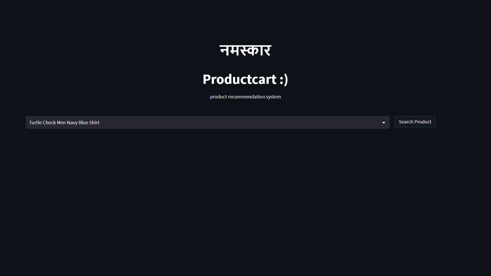
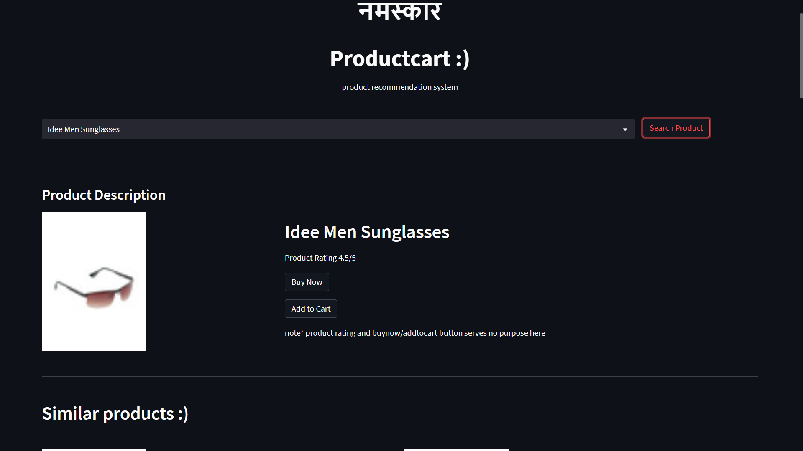
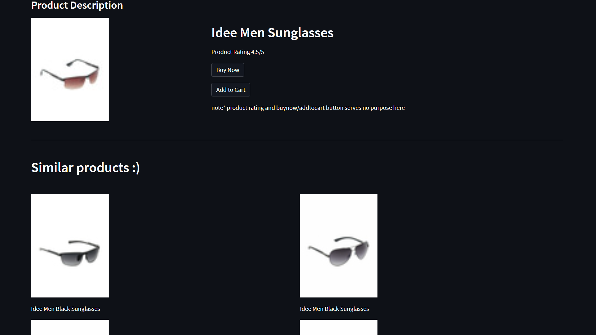

<h1>Product Recommendation System</h1>
    <h2>Requirments</h2>
    <ul>
        <li>Pandas</li>
        <li>sklearn</li>
        <li>nltk</li>
        <li>csv</li>
        <li>tqdm</li>
        <li>ast</li>
        <li>pickle</li>
        <li>streamlit</li>
    </ul>
    <h2>Instructions to run</h2>
    <ul>
        <li>Download dataset from <a href="https://www.kaggle.com/datasets/paramaggarwal/fashion-product-images-small">https://www.kaggle.com/datasets/paramaggarwal/fashion-product-images-small</a></li>
        <li>Unzip dataset</li>
        <li>rename it to "archive (1)"</li>
        <li>directory structure must look like
            <ul>
                <li>archive (1)</li>
                <ul>
                    <li>images</li>
                    <li>styles.csv</li>
                </ul>
                <li>main.ipynb</li>
                <li>app.py</li>
                <li>style.css</li>
            </ul>
        </li>
        <li>First run main.ipynb</li>
        <li>Two files with name vectors.pkl and df.pkl created</li>
        <li>directory structure should look like
            <ul>
                <li>archive (1)</li>
                <ul>
                    <li>images</li>
                    <li>styles.csv</li>
                </ul>
                <li>main.ipynb</li>
                <li>app.py</li>
                <li>style.css</li>
                <li>vectors.pkl</li>
                <li>df.pkl</li>
            </ul>
        </li>
        <li>Run app.py by using command <code>streamlit run app.py </code> </li>
    </ul>
    <h1>Page looks like</h1>

<h3>main page</h3>

<h3>searching an item</h3>

<h3>20 similar items</h3>

